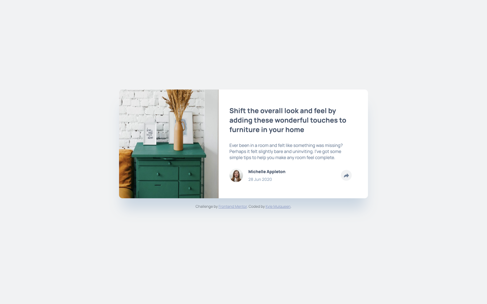
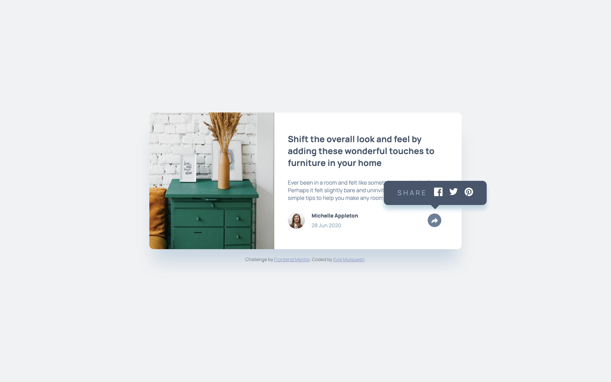
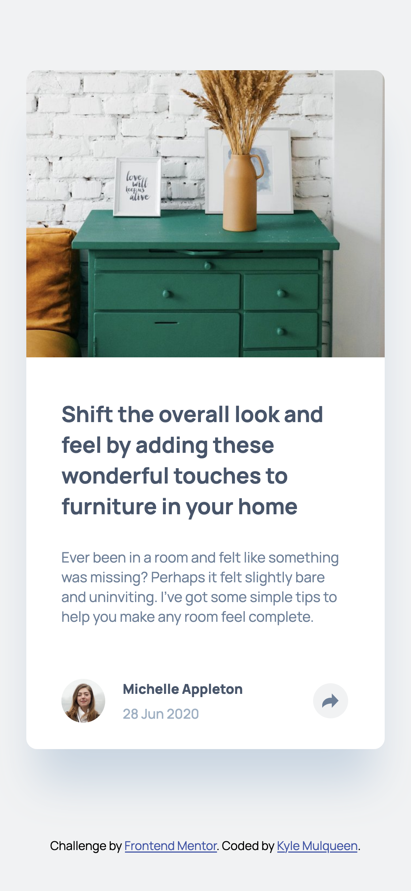
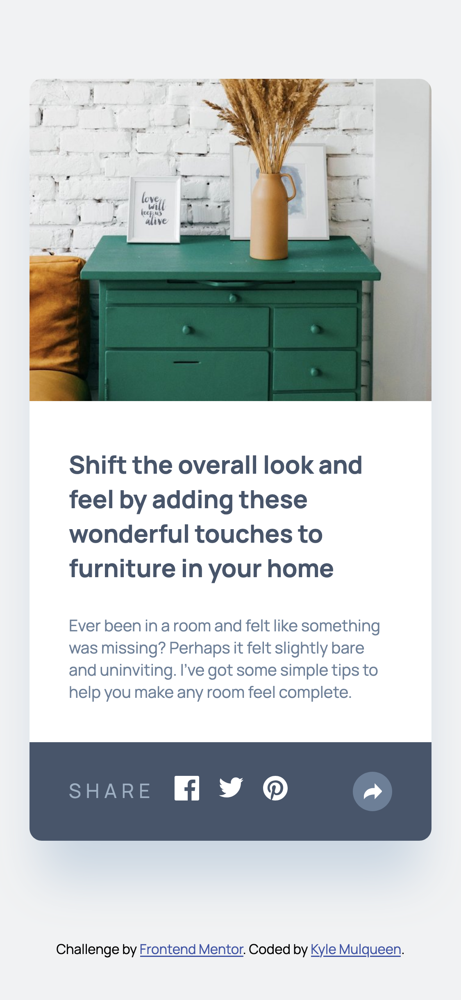

# Frontend Mentor - Article preview component solution

This is a solution to the [Article preview component challenge on Frontend Mentor](https://www.frontendmentor.io/challenges/article-preview-component-dYBN_pYFT). Frontend Mentor challenges help you improve your coding skills by building realistic projects.

## Table of contents

- [Frontend Mentor - Article preview component solution](#frontend-mentor---article-preview-component-solution)
  - [Table of contents](#table-of-contents)
  - [Overview](#overview)
    - [The challenge](#the-challenge)
    - [Screenshot](#screenshot)
    - [Links](#links)
  - [My process](#my-process)
    - [Built with](#built-with)
    - [What I learned](#what-i-learned)
    - [Continued development](#continued-development)
    - [Useful resources](#useful-resources)
  - [Author](#author)

## Overview

### The challenge

Users should be able to:

- View the optimal layout for the component depending on their device's screen size
- See the social media share links when they click the share icon

### Screenshot






### Links

- Solution URL: [GitHub Pages](https://kmulqueen.github.io/article-preview-component-challenge/)

## My process

### Built with

- Semantic HTML5 markup
- CSS custom properties
- Flexbox
- CSS Grid
- Mobile-first workflow

### What I learned

During this project, I gained valuable experience with several front-end development techniques:

1. **Proper accessibility implementation** - I learned how to properly use aria attributes alongside visual elements. For example, using `aria-label` for screen readers while using `title` for visual tooltips:

   ```html
   <button
     aria-label="Share this article"
     title="Show share links"
     class="share-button"
   >
     <!-- SVG icon here -->
   </button>
   ```

2. **Toggleable components** - I learned to properly toggle element visibility while maintaining accessibility by setting both the appropriate class and aria attributes:

   ```js
   function toggleShareToast() {
     toastSection.classList.toggle("hidden");
     const isHidden = toastSection.classList.contains("hidden");
     toastSection.setAttribute("aria-hidden", isHidden);
     // Additional handling...
   }
   ```

3. **DRY code principles** - I refactored my JavaScript to avoid duplicating event handler logic:

   ```js
   // Define a single function for both buttons
   function toggleShareToast() {
     /* shared logic */
   }

   // Add to both buttons
   shareBtnAuthor.addEventListener("click", toggleShareToast);
   shareBtnToast.addEventListener("click", toggleShareToast);
   ```

4. **Responsive design considerations** - I implemented different UI behaviors based on screen size:

   ```js
   const maxMobileSize = 768;
   const deviceWidth = window.innerWidth;

   if (deviceWidth < maxMobileSize) {
     authorSection.classList.toggle("hidden");
   } else {
     shareBtnToast.classList.toggle("hidden");
   }
   ```

### Continued development

Moving forward, I'd like to focus on:

1. **CSS Grid mastery** - I encountered issues with my grid layout syntax. I want to better understand grid template areas and more complex grid layouts.

2. **More sophisticated UI interactions** - I'd like to explore more advanced UI patterns beyond simple toggle functionality, such as animations and transitions.

3. **Better handling of focus states** - While I learned to manually blur elements with JavaScript, I'd like to implement more robust focus management for better keyboard navigation.

4. **Speech bubble styling techniques** - I want to explore different approaches for creating speech bubble UI elements with CSS, especially for responsive designs.

5. **More elegant overflow solutions** - Finding better ways to handle elements that need to overflow their containers without breaking other styling aspects like border-radius.
6. **Strategic HTML structure planning** - I want to improve how I plan my HTML structure to better accommodate styling needs while maintaining semantic integrity. For example, my toast notification being nested inside the article element limited my styling options (like using z-index). Next time, I would:
   - Consider positioning contexts more carefully (perhaps placing the toast outside the article but still semantically connected)
   - Use wrapper/container elements more strategically to isolate styling concerns
   - Structure my HTML with CSS positioning in mind from the start
   - Create more independent components that can be positioned freely without affecting each other
   - Maintain document semantics while planning for visual presentation needs

### Useful resources

- [MDN Web Docs on ARIA](https://developer.mozilla.org/en-US/docs/Web/Accessibility/ARIA) - This helped me understand proper accessibility implementations. Their examples of aria-label and aria-hidden were particularly useful.

- [CSS-Tricks Guide to CSS Grid](https://css-tricks.com/snippets/css/complete-guide-grid/) - Excellent visual guide to CSS Grid that helped me understand where my grid syntax was incorrect.

- [A11y Project](https://www.a11yproject.com/) - This resource improved my understanding of accessibility best practices, particularly for interactive elements like my share buttons.

- [CSS Speech Bubbles](https://freefrontend.com/css-speech-bubbles/) - Collection of techniques for creating speech bubbles, which helped with styling my toast notification.

## Author

- Website - [Kyle Mulqueen](https://kmulqueen.github.io/portfolio-2025/)
- Frontend Mentor - [@kmulqueen](https://www.frontendmentor.io/profile/yourusername)
